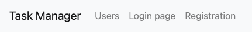
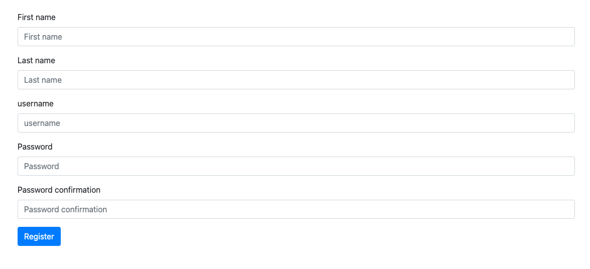
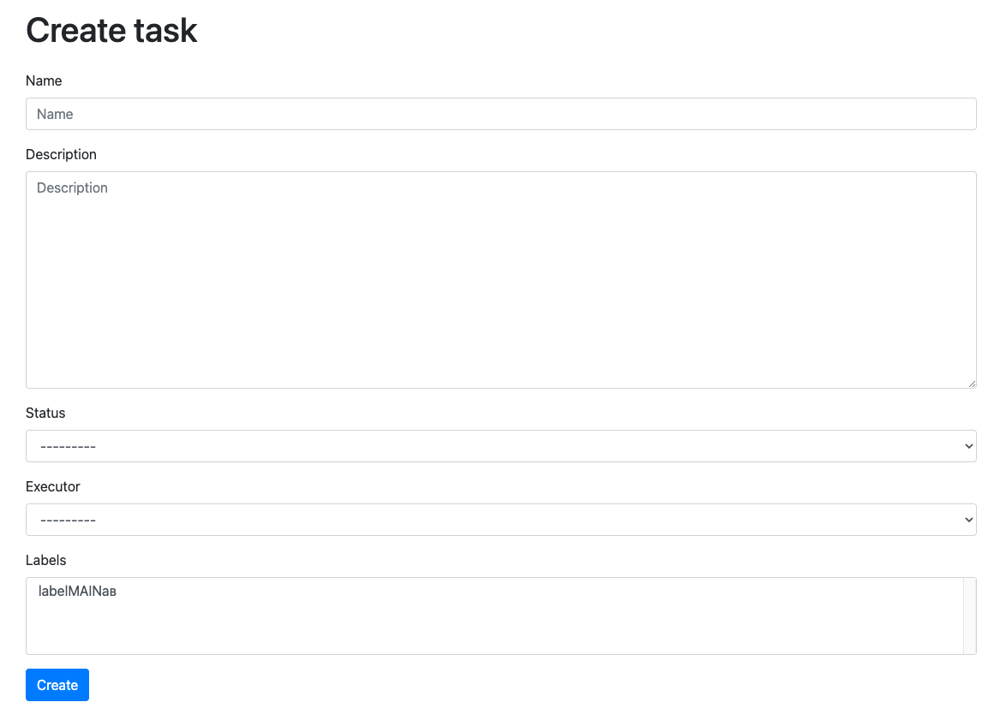
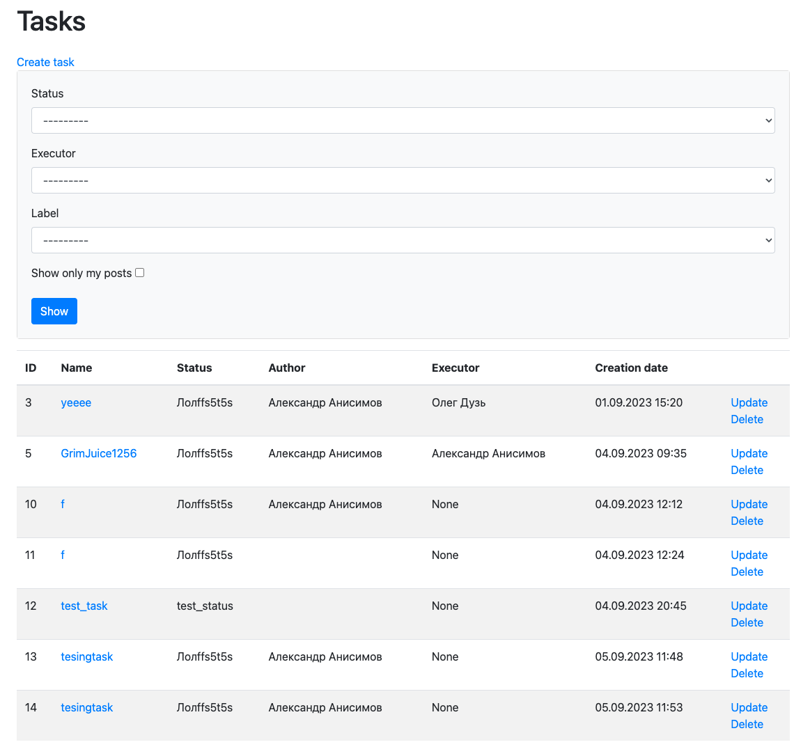

### Hexlet tests and linter status:
[](https://github.com/AnisimoffA/python-project-52/actions)
[](https://codeclimate.com/github/AnisimoffA/python-project-52/test_coverage)

Task Manager link: [Here](python-project-52-production-312b.up.railway.app)

### Description

This framework is a convenient task manager built on python 3.8 and django 4.2. To use the system, you must be registered.



___
Here You can create a task list



and also You can also view all the tasks, change their status and add the necessary labels.



___
### How to use it?

Firstly, clone the repo:
```python
git clone https://github.com/AnisimoffA/python-project-52
```

Secondary, generate an .env file located in the project's primary directory. You will be required to define specific variables within it:
```python
DATABASE_URL={provider}://{user}:{password}@{host}:{port}/{db}
SECRET_KEY={your secret key}
LANGUAGE=en-us # Or "ru" if you want
```

Thirdly, run the server:
```python
python3 manage.py runserver
```
___
### Requirements

- Python ^3.2
- Django ^4.2
- Flake8 ^4.0.1
- Bootstrap 4
- Gunicorn ^21.0.0